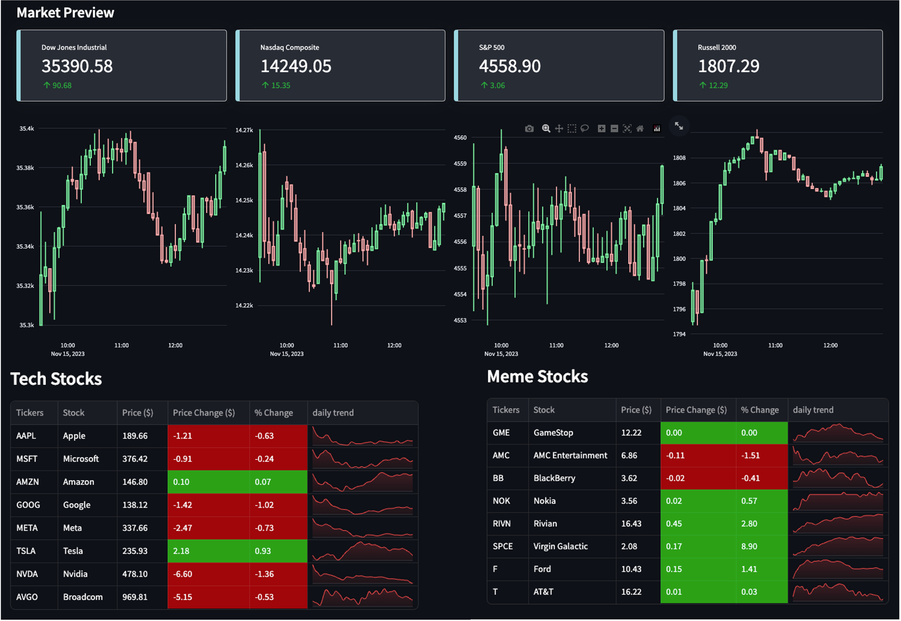
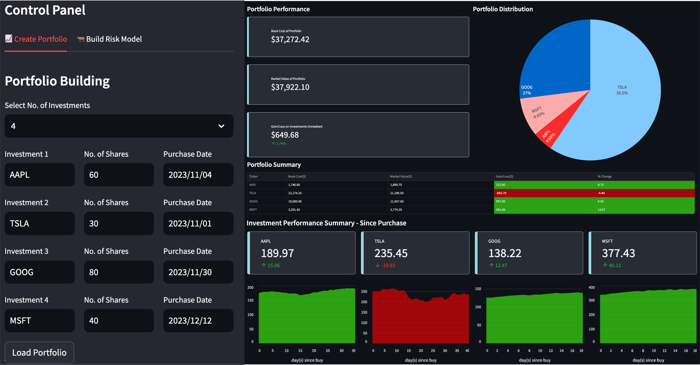
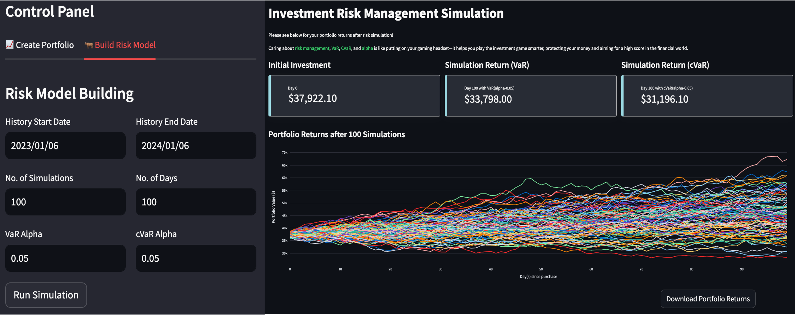

# MindInventory - Portfolio & Risk Management System
*FinRisk allows you to build a custom portfolio and assess its risk within 
few clicks!*

*Portfolio Risk management is like wearing a helmet while riding a bike—it 
shields your money during investments. For average investors, it's hard to 
understand the risk of their portfolio, FinRisk is here to help.*

## Core Features
### Real Time Market Condition Previewer
Quick Glimpse of the Financial Frenzy! The market preview includes current
market status of Dow Jones, S&P 500, Nasdaq, and Russell 2000 index. Hold onto 
your seat as we zoom into the exciting world of the top 8 tech and meme stocks! 
🚀🎢 Get the scoop on current prices, price changes, and the percentage shake-ups.

### Portfolio Builder
Dream big and curate a portfolio that reflects your financial aspirations. You 
have the power to choose up to 10 stocks!For each stock in your portfolio, some 
fundamental information required: stock tickers, the specific quantity of shares, 
and the record of purchase dates.

### Portfolio Risk Simulator
The portfolio risk simulator is a powerful tool that allows you to assess your portfolio's risk using
Monte Carlo Simulation. The simulation unravels crucial metrics: Value at Risk (VaR) and Conditional Value 
at Risk (CVaR). VaR adn CVaR are two of the most popular risk metrics used by financial institutions to 
measure the risk of their portfolios. Simulation can be tailored to your needs by adjusting the number 
of simulations, historical data of your selected stocks, the confidence levels (alpha). The simulation 
will also generate a line chart for your portfolio's daily returns. All data can be downloaded as a CSV file for
further analysis.

## How to Use
👉 <a href="http://https://mindinventory-financial-risk-model.streamlit.app/" target="_blank"> Click here </a>
 to Launch the app
